# III. User Flows

> *This document defines runtime interaction patterns through sequence diagrams, making the execution flow and inter-component communication explicit for each user-facing operation.*

The following diagrams detail how browser requests traverse the server, interact with PostgreSQL for persistent state, consult Redis for sessions and rate limiting, and offload inference work to Celery workers running concurrently with the web server. Each flow demonstrates the authentication and authorization boundary applied before a request reaches its handler, as well as the role checks enforced on administrative pages.

Where a handler returns an HTML fragment rather than a full document, the diagram notes the HTMX swap target so the partial-update behaviour is explicit.

## `GET /health/shallow`

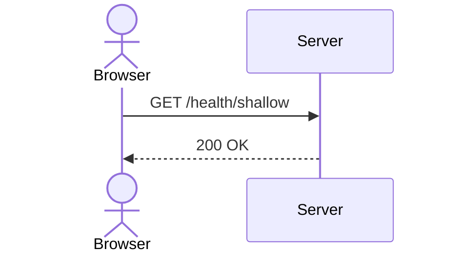
```mermaid
sequenceDiagram
    actor B as Browser
    participant S as Server
    B->>S: GET /health/shallow
    S-->>B: 200 OK
```

## `GET /health/deep`

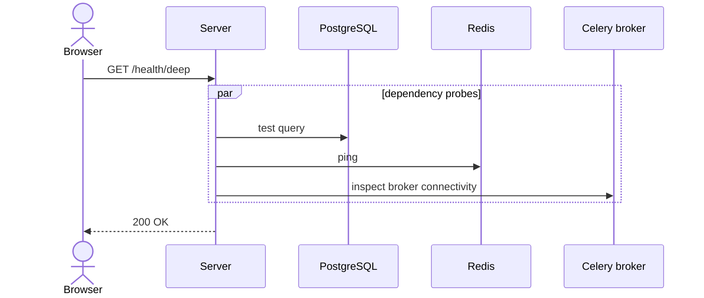
```mermaid
sequenceDiagram
    actor B as Browser
    participant S as Server
    participant DB as PostgreSQL
    participant R as Redis
    participant C as Celery broker
    B->>S: GET /health/deep
    par dependency probes
        S->>DB: test query
        S->>R: ping
        S->>C: inspect broker connectivity
    end
    S-->>B: 200 OK
```

## `GET /register`

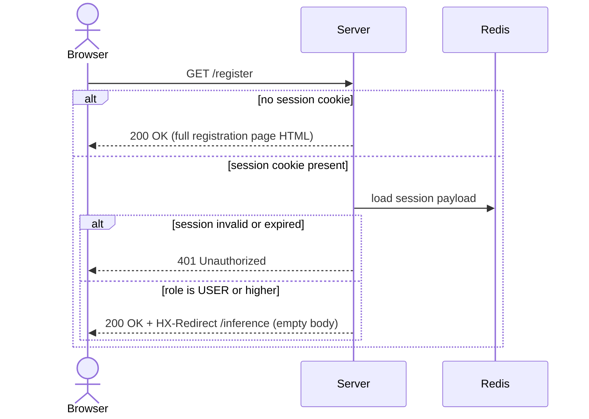
```mermaid
sequenceDiagram
    actor B as Browser
    participant S as Server
    participant R as Redis
    B->>S: GET /register
    alt no session cookie
        S-->>B: 200 OK (full registration page HTML)
    else session cookie present
        S->>R: load session payload
        alt session invalid or expired
            S-->>B: 401 Unauthorized
        else role is USER or higher
            S-->>B: 200 OK + HX-Redirect /inference (empty body)
        end
    end
```

This is a full-page navigation (navbar link or direct URL), not an HTMX request. The server returns the HX-Redirect header, but a standard browser does not follow it on GET; HTMX clients do. Authenticated users normally never see the Register link in the navbar.

## `POST /register`

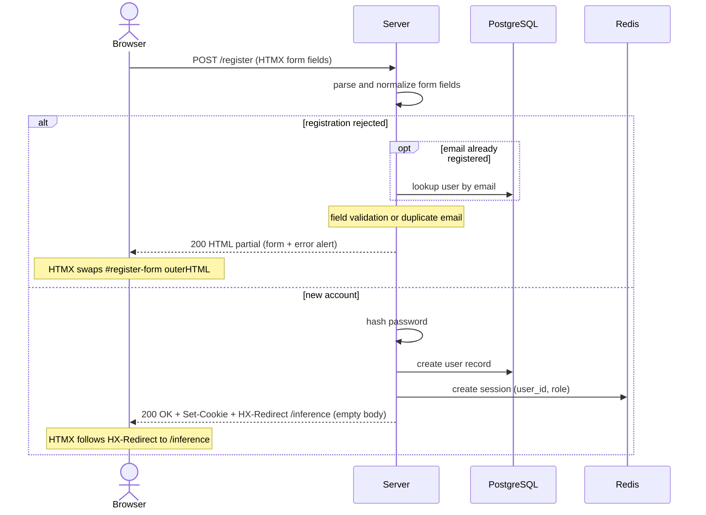
```mermaid
sequenceDiagram
    actor B as Browser
    participant S as Server
    participant DB as PostgreSQL
    participant R as Redis
    B->>S: POST /register (HTMX form fields)
    S->>S: parse and normalize form fields
    alt registration rejected
        opt email already registered
            S->>DB: lookup user by email
        end
        Note over S: field validation or duplicate email
        S-->>B: 200 HTML partial (form + error alert)
        Note over B: HTMX swaps #35;register-form outerHTML
    else new account
        S->>S: hash password
        S->>DB: create user record
        S->>R: create session (user_id, role)
        S-->>B: 200 OK + Set-Cookie + HX-Redirect /inference (empty body)
        Note over B: HTMX follows HX-Redirect to /inference
    end
```

Field validation runs in the handler before any database access. The handler does not block already-authenticated users on POST (only GET redirects them).

## `GET /login`

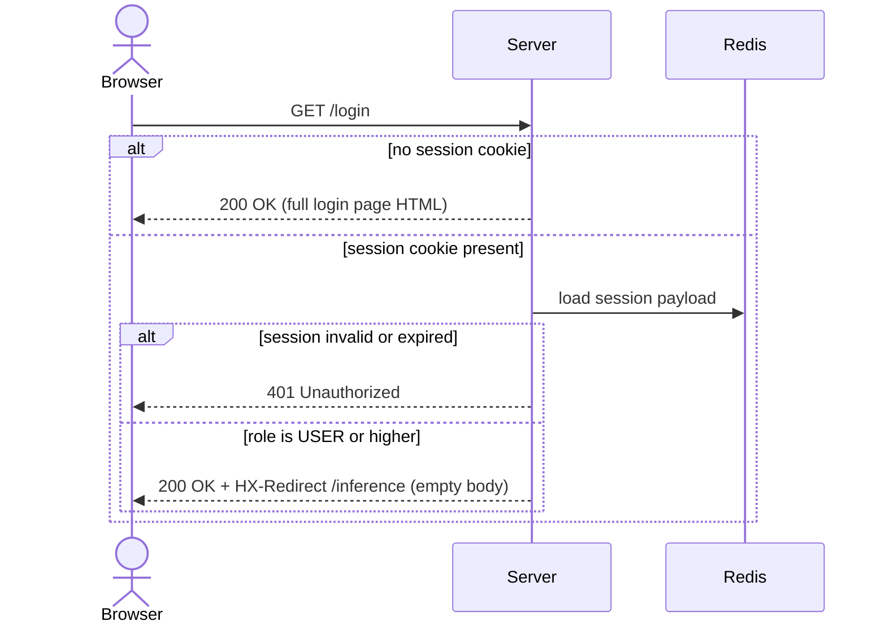
```mermaid
sequenceDiagram
    actor B as Browser
    participant S as Server
    participant R as Redis
    B->>S: GET /login
    alt no session cookie
        S-->>B: 200 OK (full login page HTML)
    else session cookie present
        S->>R: load session payload
        alt session invalid or expired
            S-->>B: 401 Unauthorized
        else role is USER or higher
            S-->>B: 200 OK + HX-Redirect /inference (empty body)
        end
    end
```

Same as GET /register: full-page navigation; HX-Redirect is not followed by a standard browser on GET.

## `POST /login`

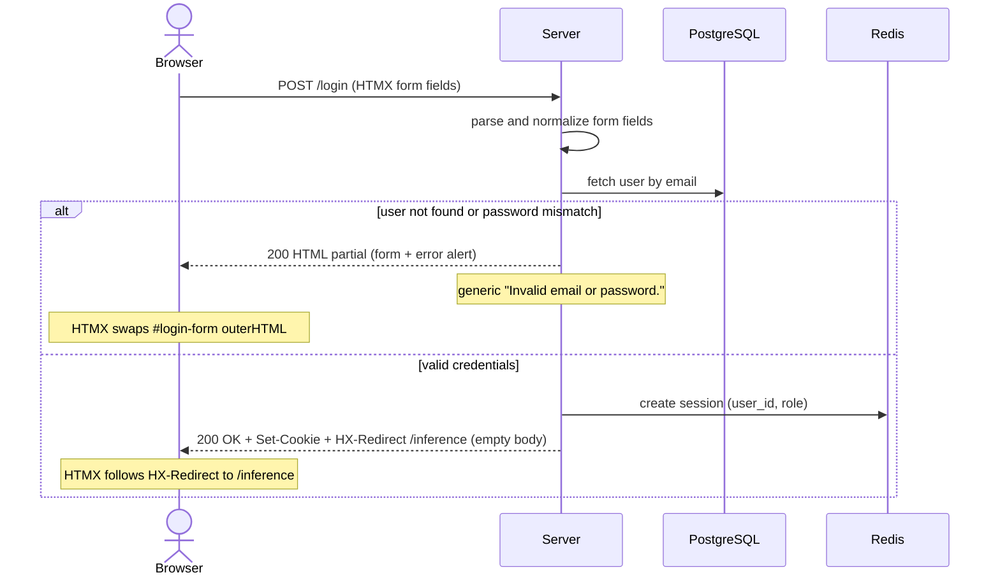
```mermaid
sequenceDiagram
    actor B as Browser
    participant S as Server
    participant DB as PostgreSQL
    participant R as Redis
    B->>S: POST /login (HTMX form fields)
    S->>S: parse and normalize form fields
    S->>DB: fetch user by email
    alt user not found or password mismatch
        S-->>B: 200 HTML partial (form + error alert)
        Note over S: generic "Invalid email or password."
        Note over B: HTMX swaps #35;login-form outerHTML
    else valid credentials
        S->>R: create session (user_id, role)
        S-->>B: 200 OK + Set-Cookie + HX-Redirect /inference (empty body)
        Note over B: HTMX follows HX-Redirect to /inference
    end
```

Login does not expose field-level validation errors; any failed credential check returns the same generic message.

## `POST /logout`

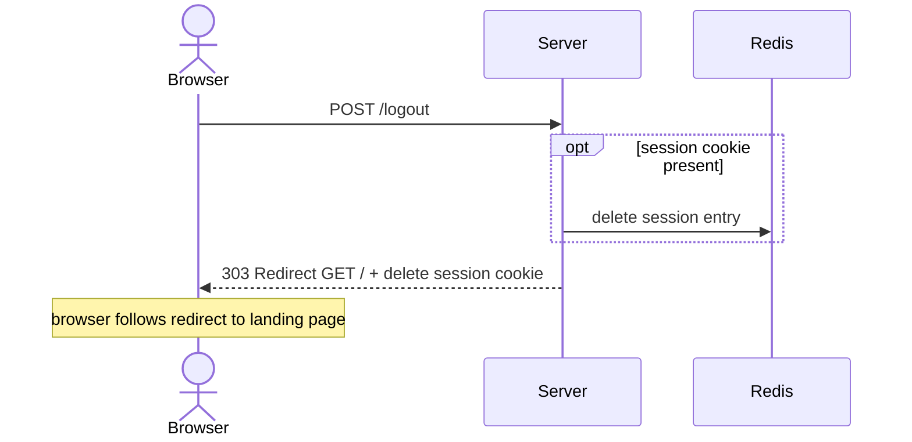
```mermaid
sequenceDiagram
    actor B as Browser
    participant S as Server
    participant R as Redis
    B->>S: POST /logout
    opt session cookie present
        S->>R: delete session entry
    end
    S-->>B: 303 Redirect GET / + delete session cookie
    Note over B: browser follows redirect to landing page
```

Standard HTML form POST from the navbar (not HTMX). Redis delete runs only when a cookie is present; the session cookie is always cleared on the response.

## `GET /collaborate`

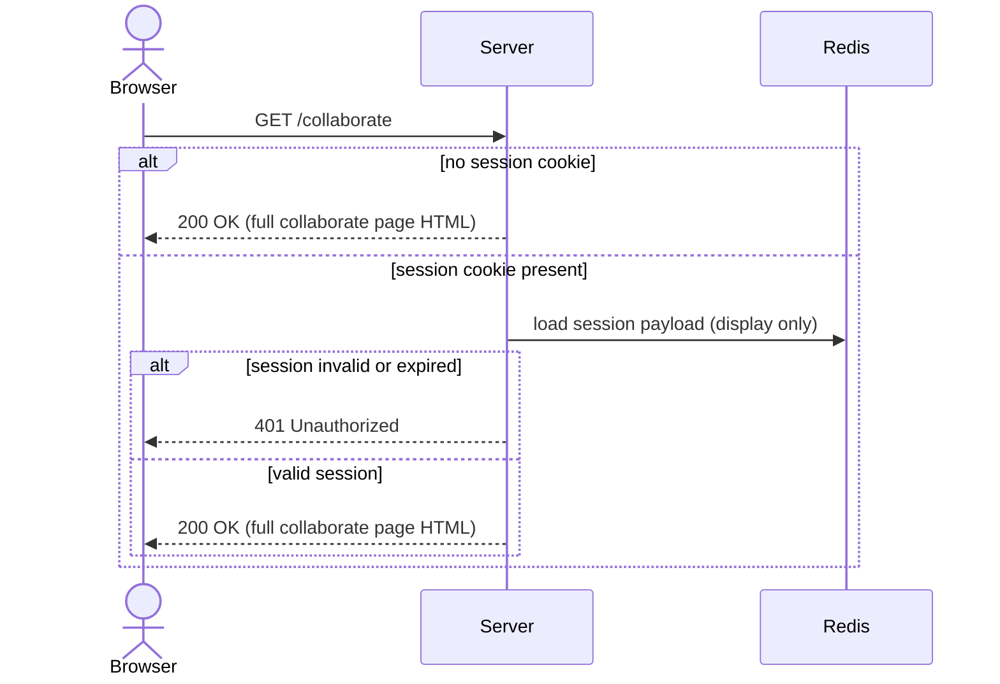
```mermaid
sequenceDiagram
    actor B as Browser
    participant S as Server
    participant R as Redis
    B->>S: GET /collaborate
    alt no session cookie
        S-->>B: 200 OK (full collaborate page HTML)
    else session cookie present
        S->>R: load session payload (display only)
        alt session invalid or expired
            S-->>B: 401 Unauthorized
        else valid session
            S-->>B: 200 OK (full collaborate page HTML)
        end
    end
```

Public page for all visitors; authenticated users are not redirected away (unlike register/login).

## `POST /collaborate`

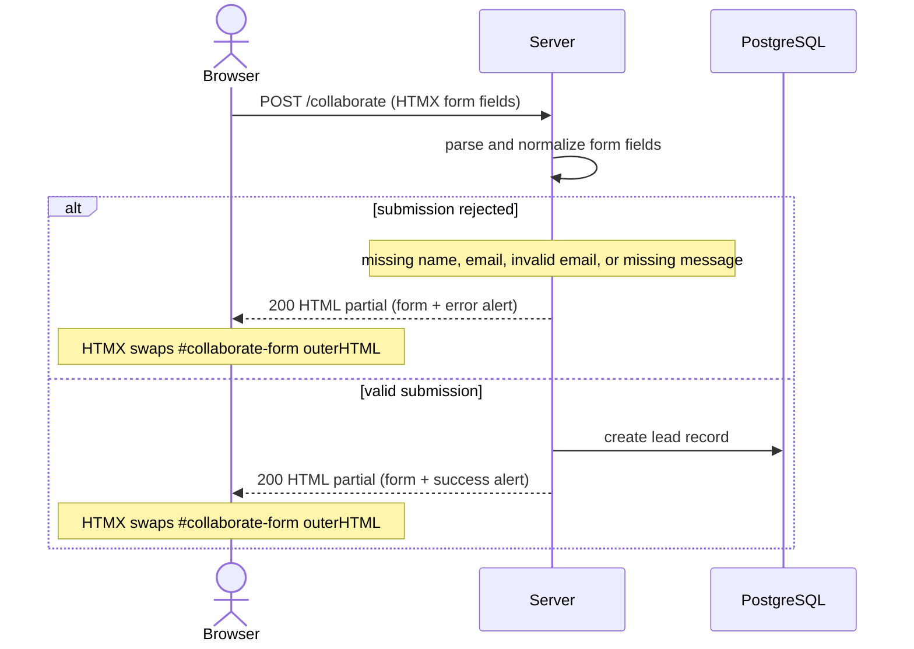
```mermaid
sequenceDiagram
    actor B as Browser
    participant S as Server
    participant DB as PostgreSQL
    B->>S: POST /collaborate (HTMX form fields)
    S->>S: parse and normalize form fields
    alt submission rejected
        Note over S: missing name, email, invalid email, or missing message
        S-->>B: 200 HTML partial (form + error alert)
        Note over B: HTMX swaps #35;collaborate-form outerHTML
    else valid submission
        S->>DB: create lead record
        S-->>B: 200 HTML partial (form + success alert)
        Note over B: HTMX swaps #35;collaborate-form outerHTML
    end
```

No authentication required. Company is optional; all other fields are validated before the lead is persisted.

## `GET /inference`

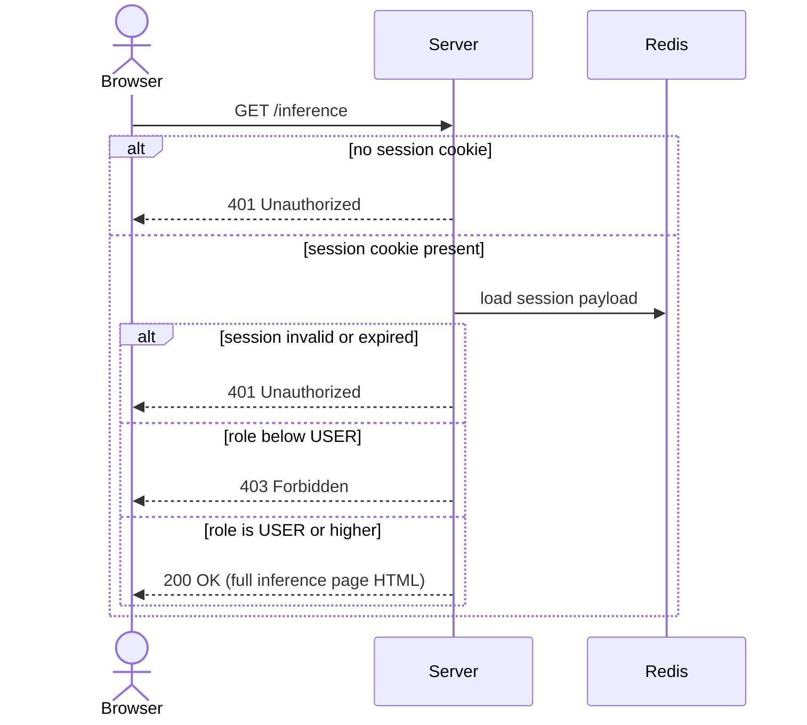
```mermaid
sequenceDiagram
    actor B as Browser
    participant S as Server
    participant R as Redis
    B->>S: GET /inference
    alt no session cookie
        S-->>B: 401 Unauthorized
    else session cookie present
        S->>R: load session payload
        alt session invalid or expired
            S-->>B: 401 Unauthorized
        else role below USER
            S-->>B: 403 Forbidden
        else role is USER or higher
            S-->>B: 200 OK (full inference page HTML)
        end
    end
```

## `POST /inference`

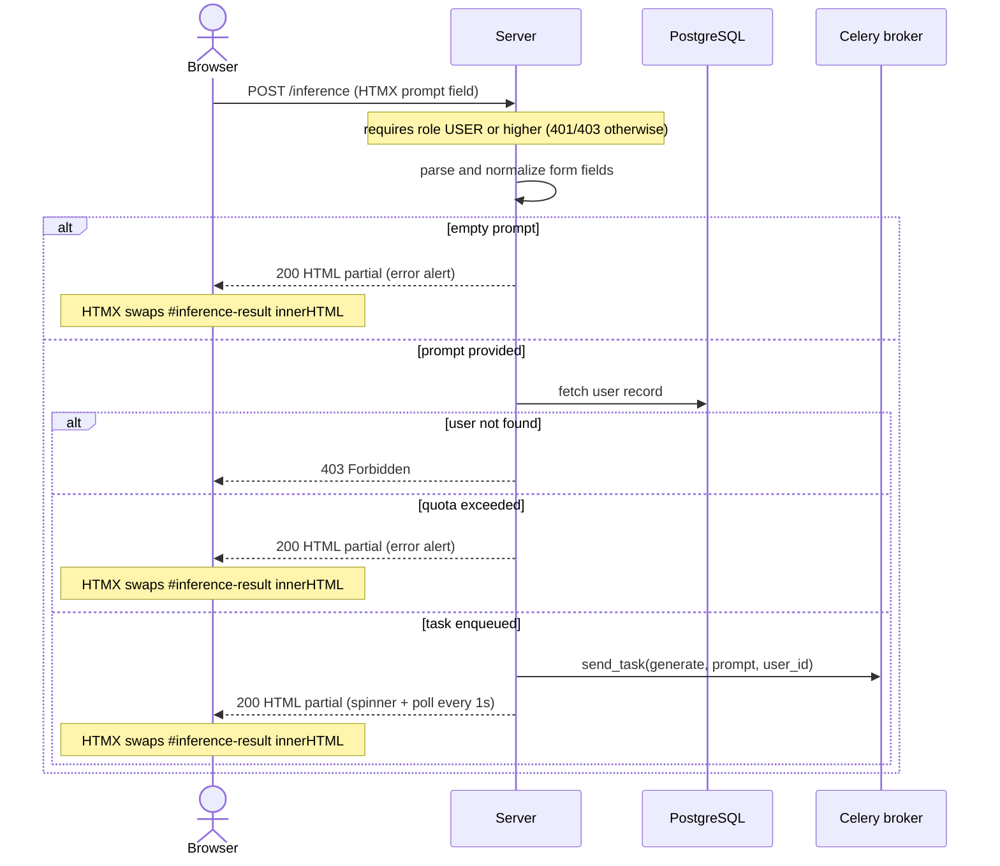
```mermaid
sequenceDiagram
    actor B as Browser
    participant S as Server
    participant DB as PostgreSQL
    participant Q as Celery broker
    B->>S: POST /inference (HTMX prompt field)
    Note over S: requires role USER or higher (401/403 otherwise)
    S->>S: parse and normalize form fields
    alt empty prompt
        S-->>B: 200 HTML partial (error alert)
        Note over B: HTMX swaps #35;inference-result innerHTML
    else prompt provided
        S->>DB: fetch user record
        alt user not found
            S-->>B: 403 Forbidden
        else quota exceeded
            S-->>B: 200 HTML partial (error alert)
            Note over B: HTMX swaps #35;inference-result innerHTML
        else task enqueued
            S->>Q: send_task(generate, prompt, user_id)
            S-->>B: 200 HTML partial (spinner + poll every 1s)
            Note over B: HTMX swaps #35;inference-result innerHTML
        end
    end
```

Empty prompt is rejected before any database access. Error alerts swap only the result container; the prompt form stays intact.

## `GET /inference/status/{task_id}`

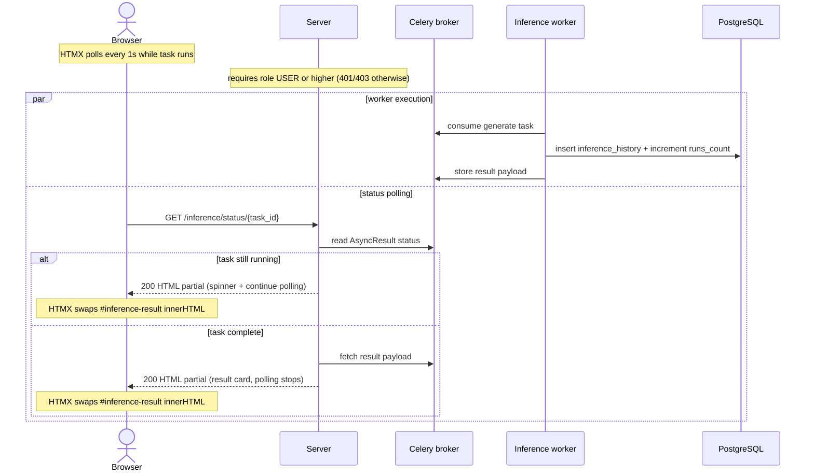
```mermaid
sequenceDiagram
    actor B as Browser
    participant S as Server
    participant Q as Celery broker
    participant W as Inference worker
    participant DB as PostgreSQL
    Note over B: HTMX polls every 1s while task runs
    Note over S: requires role USER or higher (401/403 otherwise)
    par worker execution
        W->>Q: consume generate task
        W->>DB: insert inference_history + increment runs_count
        W->>Q: store result payload
    and status polling
        B->>S: GET /inference/status/{task_id}
        S->>Q: read AsyncResult status
        alt task still running
            S-->>B: 200 HTML partial (spinner + continue polling)
            Note over B: HTMX swaps #35;inference-result innerHTML
        else task complete
            S->>Q: fetch result payload
            S-->>B: 200 HTML partial (result card, polling stops)
            Note over B: HTMX swaps #35;inference-result innerHTML
        end
    end
```

Polling reads the Celery result backend only; persistence happens in the worker before the result payload is stored.

## `GET /inference/history`

```mermaid
sequenceDiagram
    actor B as Browser
    participant S as Server
    participant R as Redis
    participant DB as PostgreSQL
    B->>S: GET /inference/history?page=N
    alt no session cookie
        S-->>B: 401 Unauthorized
    else session cookie present
        S->>R: load session payload
        alt session invalid or expired
            S-->>B: 401 Unauthorized
        else role below USER
            S-->>B: 403 Forbidden
        else role is USER or higher
            S->>S: parse page query parameter
            S->>DB: count and fetch history for current user
            alt regular page load
                S-->>B: 200 OK (full history page HTML)
            else HTMX pagination request
                S-->>B: 200 HTML partial (records + pagination)
                Note over B: HTMX swaps #35;history-list innerHTML
            end
        end
    end
```

History is scoped to the authenticated user. HTMX pagination is detected via the HX-Request header. When there are no records, the response is an empty-state partial instead of the list container.

## `GET /leads`

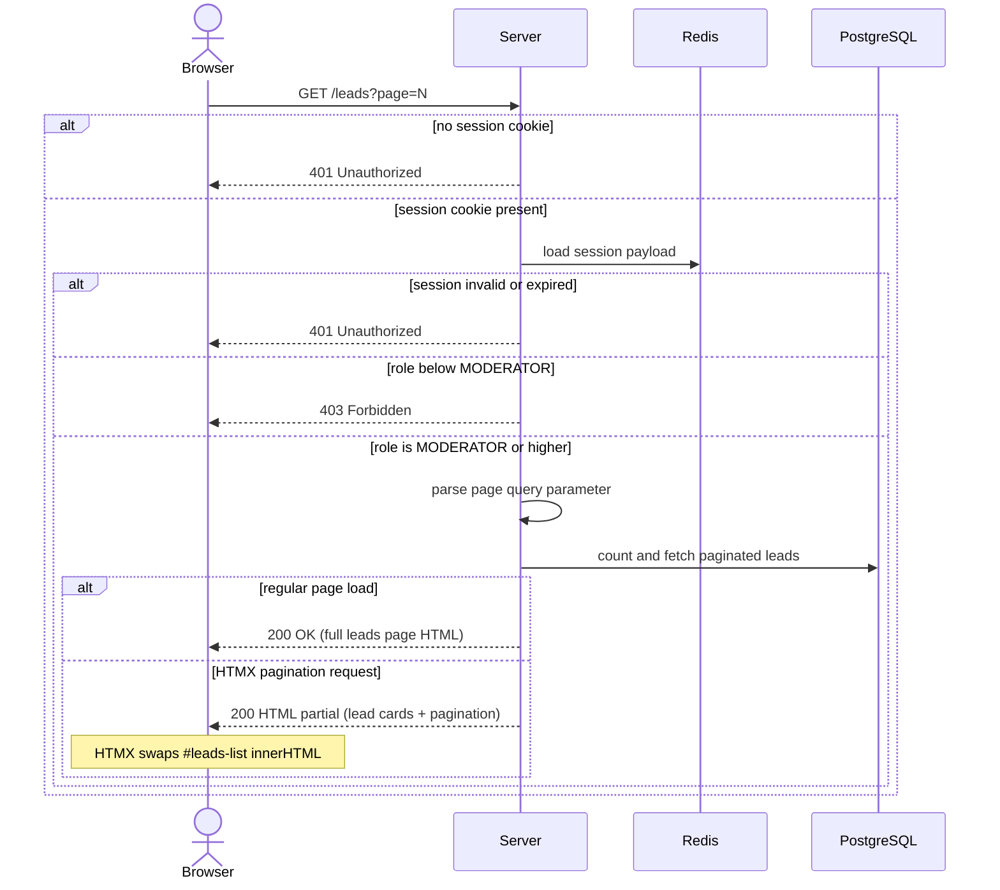
```mermaid
sequenceDiagram
    actor B as Browser
    participant S as Server
    participant R as Redis
    participant DB as PostgreSQL
    B->>S: GET /leads?page=N
    alt no session cookie
        S-->>B: 401 Unauthorized
    else session cookie present
        S->>R: load session payload
        alt session invalid or expired
            S-->>B: 401 Unauthorized
        else role below MODERATOR
            S-->>B: 403 Forbidden
        else role is MODERATOR or higher
            S->>S: parse page query parameter
            S->>DB: count and fetch paginated leads
            alt regular page load
                S-->>B: 200 OK (full leads page HTML)
            else HTMX pagination request
                S-->>B: 200 HTML partial (lead cards + pagination)
                Note over B: HTMX swaps #35;leads-list innerHTML
            end
        end
    end
```

HTMX pagination is detected via the HX-Request header. When there are no leads, the partial is an empty-state message instead of the list container.

## `POST /leads/{id}/status`

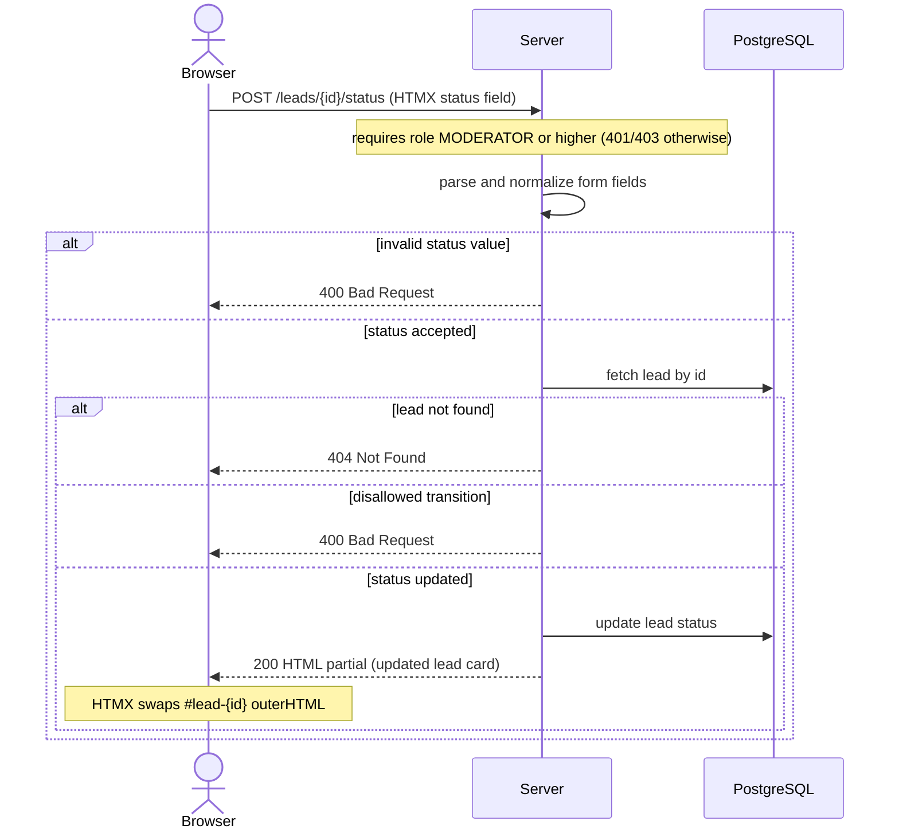
```mermaid
sequenceDiagram
    actor B as Browser
    participant S as Server
    participant DB as PostgreSQL
    B->>S: POST /leads/{id}/status (HTMX status field)
    Note over S: requires role MODERATOR or higher (401/403 otherwise)
    S->>S: parse and normalize form fields
    alt invalid status value
        S-->>B: 400 Bad Request
    else status accepted
        S->>DB: fetch lead by id
        alt lead not found
            S-->>B: 404 Not Found
        else disallowed transition
            S-->>B: 400 Bad Request
        else status updated
            S->>DB: update lead status
            S-->>B: 200 HTML partial (updated lead card)
            Note over B: HTMX swaps #35;lead-{id} outerHTML
        end
    end
```

Status is submitted via hx-vals on the transition buttons. Invalid status and disallowed transitions both return 400; the lead lookup runs only after the status value parses successfully.

## `GET /users`

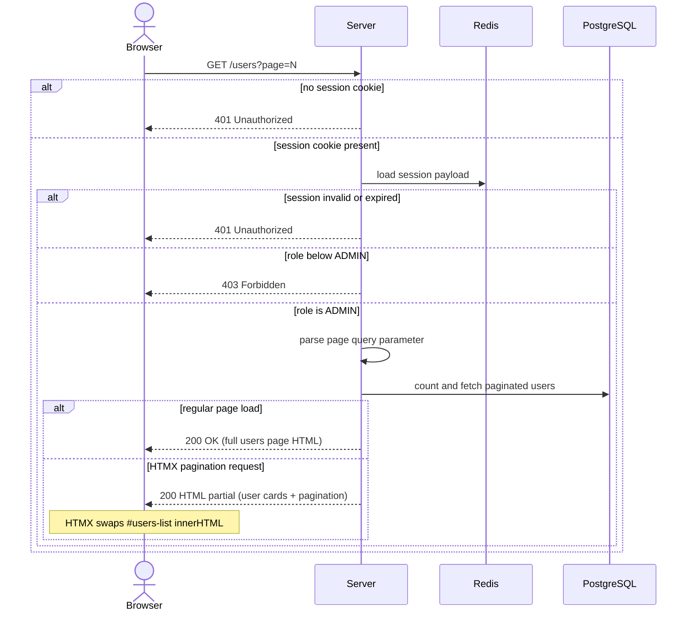
```mermaid
sequenceDiagram
    actor B as Browser
    participant S as Server
    participant R as Redis
    participant DB as PostgreSQL
    B->>S: GET /users?page=N
    alt no session cookie
        S-->>B: 401 Unauthorized
    else session cookie present
        S->>R: load session payload
        alt session invalid or expired
            S-->>B: 401 Unauthorized
        else role below ADMIN
            S-->>B: 403 Forbidden
        else role is ADMIN
            S->>S: parse page query parameter
            S->>DB: count and fetch paginated users
            alt regular page load
                S-->>B: 200 OK (full users page HTML)
            else HTMX pagination request
                S-->>B: 200 HTML partial (user cards + pagination)
                Note over B: HTMX swaps #35;users-list innerHTML
            end
        end
    end
```

Requires ADMIN exactly (not MODERATOR). HTMX pagination is detected via the HX-Request header. When there are no users, the partial is an empty-state message instead of the list container.

## `POST /users/{id}/role`

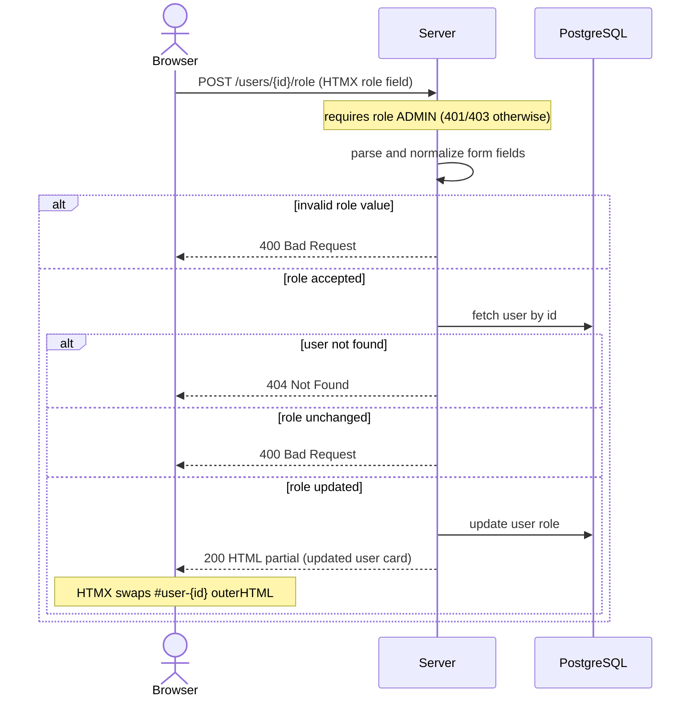
```mermaid
sequenceDiagram
    actor B as Browser
    participant S as Server
    participant DB as PostgreSQL
    B->>S: POST /users/{id}/role (HTMX role field)
    Note over S: requires role ADMIN (401/403 otherwise)
    S->>S: parse and normalize form fields
    alt invalid role value
        S-->>B: 400 Bad Request
    else role accepted
        S->>DB: fetch user by id
        alt user not found
            S-->>B: 404 Not Found
        else role unchanged
            S-->>B: 400 Bad Request
        else role updated
            S->>DB: update user role
            S-->>B: 200 HTML partial (updated user card)
            Note over B: HTMX swaps #35;user-{id} outerHTML
        end
    end
```

Role is submitted via hx-vals on the role buttons. Unchanged role is checked only after the user record is loaded.

## `POST /users/{id}/delete`

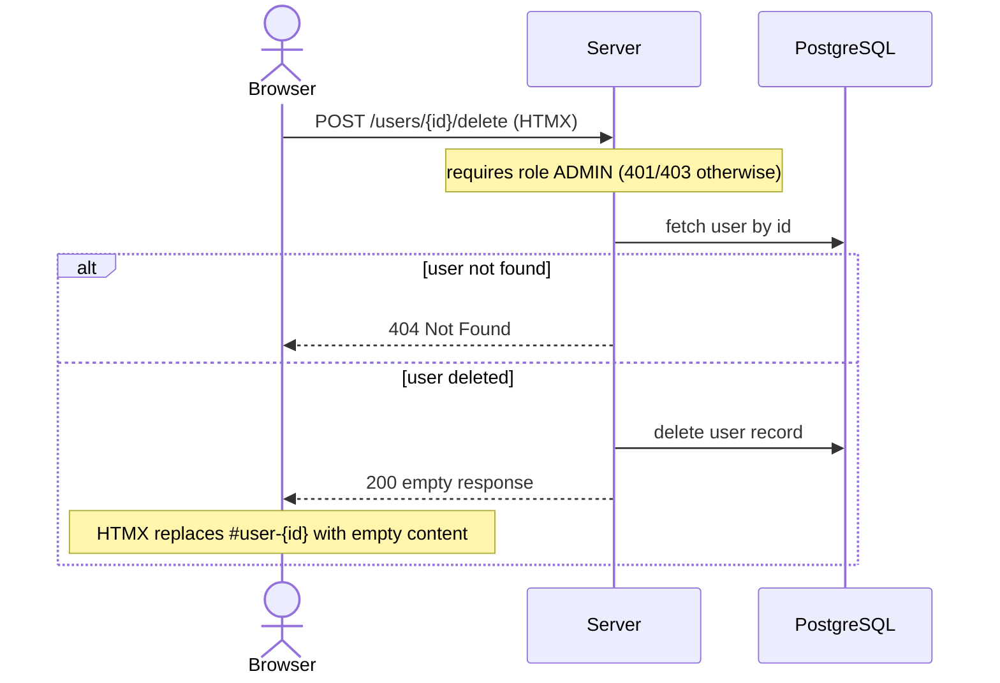
```mermaid
sequenceDiagram
    actor B as Browser
    participant S as Server
    participant DB as PostgreSQL
    B->>S: POST /users/{id}/delete (HTMX)
    Note over S: requires role ADMIN (401/403 otherwise)
    S->>DB: fetch user by id
    alt user not found
        S-->>B: 404 Not Found
    else user deleted
        S->>DB: delete user record
        S-->>B: 200 empty response
        Note over B: HTMX replaces #35;user-{id} with empty content
    end
```

Associated inference history is removed by the database CASCADE constraint on the foreign key, not by an explicit delete in the handler.